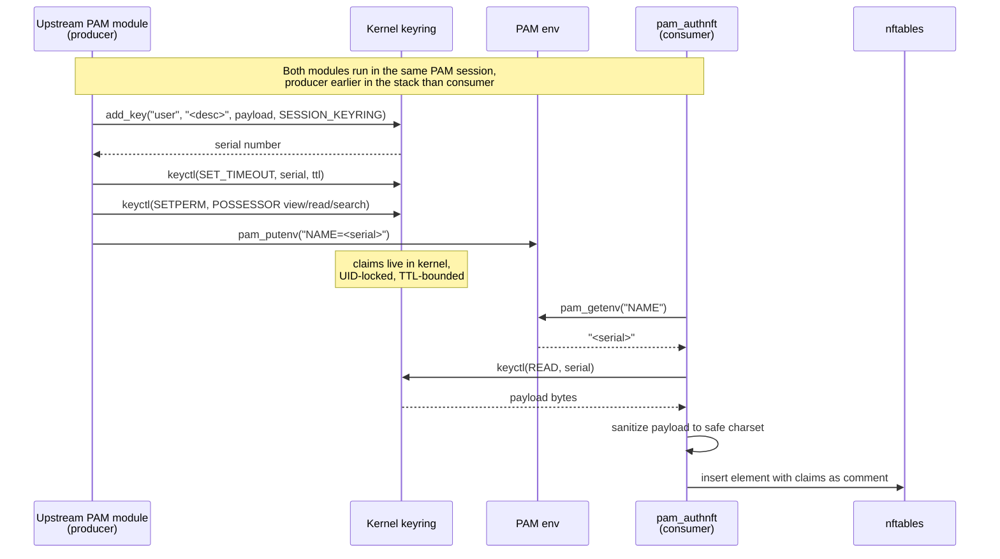

# pam_authnft admin guide

Installing, configuring, and verifying pam_authnft: quick start, the
full configuration reference, and the test targets. For the concepts
behind the cgroupv2 match see [CONCEPTS.md](CONCEPTS.md).

## Quick start

### Requirements

- Linux kernel with a cgroupv2 unified hierarchy **and** a `socket cgroupv2`
  match that works on INPUT-hooked chains. That is a patch, not a version:
  commit 05ae2fba821c ("netfilter: nft_socket: make cgroup match work in
  input too"). It is `Fixes:`-tagged, so stable trees carry it, and a version
  number alone does not tell you whether a given kernel qualifies:

  | Kernel | Status |
  |---|---|
  | < 5.13 | unsupported: `socket cgroupv2` does not exist, nftables rejects the rule |
  | 5.13-5.17 **without** the fix | **silently broken**: the rule loads but never matches, so the session's rules never apply |
  | any kernel **with** 05ae2fba821c | works. 5.15.y stable carries it, so Ubuntu 22.04 LTS is fine |
  | >= 5.18 | works (the fix landed in mainline here) |

  The middle row is the dangerous one: it fails silently rather than loudly.
  So do not infer support from the version. Run `make test-packet-match` on
  the target host — it drives the real match and exits non-zero if the kernel
  accepts the rule but never matches on it.
- systemd with D-Bus
- nftables (libnftables) — see [THIRD_PARTY.md](THIRD_PARTY.md)
  for the tested version floor
- Build: `gcc`, `make`, `pkg-config`
- Libraries: `libnftables`, `libseccomp`, `libsystemd`, `libcap`, `libaudit`, `pam`

### Build and install

```
make                # release build
make debug          # rebuild with -DDEBUG -g for stderr tracing
make man            # build pam_authnft(8) manpage (requires pandoc)
sudo make install   # installs pam_authnft.so, authnft.slice, tmpfiles.d
sudo make install-man
```

Installs the module to `/usr/lib/security/pam_authnft.so`, `authnft.slice`
to `/etc/systemd/system/`, and the tmpfiles.d snippet that creates
`/run/authnft/sessions/` at boot to `/usr/lib/tmpfiles.d/authnft.conf`.

Packagers: `make install DESTDIR="$pkgdir"` stages the full tree without
touching the live system (no daemon-reload, no tmpfiles --create), and
`PREFIX`, `PAM_DIR`, `UNIT_DIR` and `TMPFILES_DIR` are overridable.

### Minimal working configuration

```bash
# Create the authnft group (members are subject to session firewall rules)
sudo groupadd authnft

# Add a user to the group
sudo usermod -aG authnft alice

# The fragment directory must be root-only. `make install` creates it
# 0700; check it if the directory was made by hand or by a config tool.
sudo chmod 700 /etc/authnft /etc/authnft/users

# Create a root-owned fragment for that user
sudo tee /etc/authnft/users/alice > /dev/null <<'EOF'
add rule inet authnft @session_chain socket cgroupv2 level 2 . ip saddr @session_v4 accept
EOF
sudo chmod 644 /etc/authnft/users/alice
```

The module checks both at every session open. The fragment must be
root-owned and not writable by group or other, and its directory must be
0700 root:root. A session whose fragment or directory fails either check
is denied, with the reason in the log. The directory matters more than
the file mode: with 0700 nobody but root can traverse in, so a 0644
fragment is unreadable to other users; at 0755 it is readable by
everyone on the host.

Add to `/etc/pam.d/sshd` (after `pam_systemd.so`):
```
session  required  pam_authnft.so
```

Group members without a valid fragment are denied at session open (logged to
syslog). Non-members pass through unaffected: the module returns success for
them itself, so `required` does not gate anyone who is not in the group.

Use `optional` instead only if you want a failed fragment to be *logged but
not block the login* — PAM discards the module's return code under `optional`,
so a member whose fragment is missing or broken would get a session with no
firewall rules applied. See [PAM stack options](#pam-stack-options).

See `examples/examples_generator.sh -f` for port-restricted, masquerade, and
time-limited fragment variants.

## Configuration reference

### Module arguments

| Argument | Default | Effect |
|---|---|---|
| `rhost_policy=lax` | ✓ | Use PAM_RHOST if it parses as an IP, else fall back to cgroup-only set |
| `rhost_policy=strict` |  | Deny session when PAM_RHOST is not a parseable IP literal (pre-0.2 behaviour) |
| `rhost_policy=kernel` |  | Derive peer IP from the session process's own **inbound** ESTABLISHED TCP socket via `NETLINK_SOCK_DIAG` (see `ss(8)`). Only a socket whose local port is one of the host's TCP listeners qualifies, so an outbound socket the process also holds (LDAP, Kerberos) is never used. If no such socket is found the lookup fails and the module falls through to `lax`. Logs a warning on divergence with PAM_RHOST. Falls through to `lax` on lookup failure |
| `claims_env=NAME` |  | Read PAM env var `NAME` for a kernel-keyring serial; embed the sanitized keyed payload in the nftables element comment. See [INTEGRATIONS.txt](INTEGRATIONS.txt) §2 |
| `AUTHNFT_NO_SANDBOX=1` |  | Disable the seccomp sandbox. Debugging only |

### Kernel keyring handoff (claims_env)

When `claims_env=NAME` is set, an upstream PAM module that runs earlier
in the same session can pass session metadata to pam_authnft through the
Linux kernel keyring. The keyring is a kernel-managed key/value store
scoped to the login session — see `keyrings(7)`. It is not a file, a
socket, or shared memory: the kernel allocates the key, enforces the
permissions, and tears it down automatically when the session ends.



The producer requirements (key type, permissions, payload format,
ordering of `SET_TIMEOUT` before `SETPERM`) are documented in
[INTEGRATIONS.txt §2](INTEGRATIONS.txt). pam_authnft treats the
payload as opaque printable ASCII — it does not parse structure, only
sanitizes and embeds. This keeps the contract narrow and lets any
producer (identity broker, AAA stack, custom module) participate without
shared code.

Why the keyring rather than a file or env var alone:

- **Lifetime managed by the kernel.** When the session ends, the keyring
  is destroyed and the claims disappear. No cleanup code needed.
- **UID-locked at the kernel level.** Other processes on the host cannot
  read another session's claims, even as root, without first acquiring
  the keyring (POSSESSOR check).
- **No filesystem footprint.** Nothing to write, sync, or unlink. No
  race conditions, no leftover state on crash.
- **Survives sshd's privilege separation.** sshd runs its whole PAM
  stack in the privileged monitor process and in forks of it that
  share the session keyring, so a key added during authentication is
  still readable when pam_authnft runs at open_session. The sandboxed
  pre-auth binary (sshd-auth, OpenSSH >= 10.0) never runs PAM and is
  not on this path.

### PAM stack options

The module resolves `authnft` group membership itself and returns
`PAM_SUCCESS` for a non-member, so the control flag only decides what happens
to a **member whose fragment is missing, insecure, or rejected** — the module
returns `PAM_AUTH_ERR` for that case.

Option A (recommended) — fail closed. A member with a broken fragment is
denied; non-members are unaffected, because the module already returned
success for them:
```
session  required  pam_authnft.so
```

Option B — fail open. PAM **discards** the module's return code under
`optional`, so a member with a broken fragment still gets a session, with no
firewall rules applied. The failure is only visible in syslog. Use this if you
are rolling the module out and do not yet want it to be able to block a login:
```
session  optional  pam_authnft.so
```

Option C — gate in PAM rather than in the module, so non-members never reach
it at all (equivalent enforcement to A, useful if you want the group check
visible in the stack):
```
session  [success=1 default=ignore]  pam_succeed_if.so  user notingroup authnft  quiet
session  required  pam_authnft.so
```

### Per-user fragments

Each group member needs `/etc/authnft/users/<username>`, owned by root and not
world-writable. Before loading, the module calls `stat(2)` on the fragment path
and rejects it unless `st_uid == 0` and the world-writable bit is clear — the
same trust model used by `/etc/nftables.conf` and sudoers includes. The
fragment's contents are read, placeholder-substituted, and executed as
nftables commands at the top level (the module does not emit an nftables
`include` for it).

A fragment may use nftables' `include` directive to pull in shared rules
from other files — for example, a group-level fragment under
`/etc/authnft/groups/` referenced by every user who belongs to that group.
libnftables resolves includes transitively. pam_authnft enforces ownership
and mode only on the top-level per-user fragment; the admin is responsible
for the permissions of every transitively included file. See
[INTEGRATIONS.txt](INTEGRATIONS.txt) §4.6 for the composition
pattern, security notes, and cycle-detection guidance.

### Where the site's default-deny goes

pam_authnft only ever adds `accept` rules. Whatever denies traffic lives
outside the module, and where you put it decides whether the module does
anything at all. Every statement in this section is pinned by a case in
`make test-packet-flow`; the case ids are in brackets.

**Put it in the module's own chain.**

```
# after `make install`, once the table exists
sudo nft add rule inet authnft filter tcp dport { 5432, 6379 } counter drop \
    comment '"site-default-deny"'
```

Position within that chain does not matter. The module places each
session's jump immediately after the shared established-accept gate, so every jump precedes your deny however many sessions open
afterwards, and whether the deny was placed before or after any of them
[E6, E8]. The ct rule stays first, so established traffic short-circuits
there instead of walking every live session chain [E9]. Before this the module appended, and a session
opened after the deny was never reached: it authenticated, installed
correct-looking rules, showed a moving counter and passed no traffic,
while an earlier session on the same host kept working [E4, E5].

**Do not use a separate base chain with `policy drop`.** This is the
arrangement most operators reach for and it silently defeats the module
[E3]:

```
# BROKEN — the module accepts, this chain drops anyway
table inet myfilter {
    chain input { type filter hook input priority filter; policy drop; }
}
```

`accept` ends the chain it fires in, not the hook. The packet still
traverses the next base chain, and a drop policy there kills it. The
module's counter shows the accept happening; the connection is dead
regardless. This is netfilter semantics, not a module limitation, and no
rule ordering fixes it: a module that only accepts cannot override a
later chain's drop.

If your site policy has to live in its own table, that table must be
taught to honour the module's decision rather than run a blanket drop
after it. There is no mechanism for that in this release; track #114.

**After a reboot** the `inet authnft` table does not exist until the
first session opens, so a deny placed inside it does not survive. Have
whatever loads your ruleset create the table and place the deny itself.
`add table` and `add chain` are idempotent, and the chain declaration
below is the module's own, so this is safe whether the loader runs
before or after the first session:

```
nft -f - <<'EOF'
add table inet authnft
add chain inet authnft filter { type filter hook input priority filter - 1; policy accept; }
add rule inet authnft filter tcp dport { 5432, 6379 } counter drop comment "site-default-deny"
EOF
```

(The comment is quoted for nft's file syntax, not the shell's: this block
is read by `nft -f`, so the `'"..."'` idiom used on a command line above
would be a syntax error here and the whole batch would install nothing.)

When the loader runs first, the module inserts its gate and every session
jump above the deny at the first open [E10, E11]. When a session gets
there first, the loader's deny appends after the existing jumps, which is
the ordinary case above [E1, E5]; integration case 10.31 runs this exact
block in both orders against the real module.

### nftables state after session open

```
# nft list table inet authnft
table inet authnft {
    set session_alice_1127936_v4 {
        typeof socket cgroupv2 level 0 . ip saddr
        flags timeout
        elements = { "authnft.slice/authnft-alice-1127936.scope" . 192.0.2.1
                     timeout 1d expires 23h55m56s comment "alice (PID:1127936)" }
    }

    set session_alice_1127936_v6 {
        typeof socket cgroupv2 level 0 . ip6 saddr
        flags timeout
    }

    set session_alice_1127936_cg {
        typeof socket cgroupv2 level 0
        flags timeout
    }

    chain filter {
        type filter hook input priority filter - 1; policy accept;
        ct state established,related ct mark & 0x00ffffff == 0x00000000 accept
        ct state established,related ct mark & 0x00ffffff == @live_sessions accept
        jump session_alice_1127936
    }

    chain session_alice_1127936 {
        socket cgroupv2 level 2 . ip saddr @session_alice_1127936_v4 accept
    }
}
```

Note: `nft list` canonicalises the set type to `level 0`; the rule
retains the configured `level 2`. This is expected nftables behaviour
— the level is a property of the rule expression, not the set type.

With `claims_env=NAME` set and a valid keyring entry produced by an earlier
module in the stack, the element comment is extended with the sanitized
payload:

```
elements = { "authnft.slice/authnft-alice-1127936.scope" . 192.0.2.1
             timeout 1d comment "alice (PID:1127936) [audit-session:7f3e9a]" }
```

The quoted path is the session's cgroupv2 scope under `authnft.slice`. The
kernel resolves it to a cgroupv2 inode at insert time. At packet
classification time, `socket cgroupv2 level 2` reads the socket's
originating cgroup and matches it against the set — binding the firewall
rule to the session without referencing PIDs, UIDs, or usernames. The
24-hour timeout is a safety net; explicit deletion at logout is the primary
cleanup mechanism.

### Runtime observability (session JSON + audit events)

pam_authnft publishes session state through two complementary out-of-band
channels, in addition to the nftables state above:

- **`/run/authnft/sessions/<scope_unit>.json`** — a per-session JSON file
  (**0640 root:root — root-only**) written on open and removed on close, with
  a versioned schema (`v=2`) containing user, cgroup path, remote IP, fragment
  path, claims tag, scope unit, and RFC 3339 open timestamp. It is *not*
  world-readable: it carries `claims_tag`, and the `authnft` group is the
  monitored-subject population, so group-readability would leak one subject's
  claims to another. A site that wants an unprivileged agent to read it should
  `chown` the file to a dedicated observer group distinct from `authnft` — the
  group-read bit is retained (mode 0640) so that is a drop-in change. The
  correlation token is *not* in this file; it is carried on the journal events
  below. Directory is created at boot by `/usr/lib/tmpfiles.d/authnft.conf`;
  orphans from failed close paths are reaped after 7 days. Full schema in
  [INTEGRATIONS.txt](INTEGRATIONS.txt) §5.6.

- **Structured journald audit events** — `AUTHNFT_EVENT=open` at session
  open and `AUTHNFT_EVENT=close` at close, both under
  `SYSLOG_IDENTIFIER=pam_authnft`, carrying a shared
  `AUTHNFT_CORRELATION` token that lets a SIEM join the two events (and,
  by convention, the upstream authentication event that produced the
  same token). Upstream PAM modules seed the correlation via
  `pam_putenv(pamh, "AUTHNFT_CORRELATION=<trace-id>")`. Full field
  schema in [INTEGRATIONS.txt](INTEGRATIONS.txt) §6.2.

Both sinks are fail-open and never deny the session: a session-file write
error logs at `LOG_WARNING`; a journal-send error re-emits the event through
`pam_syslog(LOG_INFO)` so it still reaches syslog.

### systemd controls

Because every session lands in a named `.scope` unit under `authnft.slice`,
systemd's **resource control** machinery applies to it — `man
systemd.resource-control(5)`. All settings in `data/authnft.slice` are
commented out; uncomment what you need.

**Outbound network policy** — enforced via systemd's cgroup-BPF integration,
orthogonal to nftables:
```ini
IPAddressDeny=any
IPAddressAllow=10.0.0.0/8
SocketBindDeny=ipv4:tcp:1-1023
SocketBindDeny=ipv6:tcp:1-1023
```

Plus the usual `CPUQuota=`, `MemoryMax=`, `TasksMax=`, `IOWeight=`, and the
`IPAccounting=` counters.

**What a slice cannot do.** Exec-context sandboxing — `SystemCallFilter=`,
`NoNewPrivileges=`, `CapabilityBoundingSet=`, `RestrictNamespaces=`,
`RestrictSUIDSGID=` — is **not available here**. Those directives are applied
by systemd when it *spawns* a process, and a `.scope` adopts processes that
sshd already forked; systemd never execs them. Put them in a `.slice` and
systemd parses the unit, logs `Unknown key '…' in section [Slice], ignoring`,
and starts it anyway:

```
$ systemd-analyze verify authnft.slice
authnft.slice:5: Unknown key 'SystemCallFilter' in section [Slice], ignoring.
authnft.slice:6: Unknown key 'NoNewPrivileges' in section [Slice], ignoring.
```

So a syscall filter added there is silently a no-op, not a protection. The
module's own seccomp allowlist (`SCMP_ACT_KILL`) covers the code that parses
untrusted input — the forked nftables setup child — and that is where the
containment actually is. To restrict the *user's* session processes, set the
limits on the service that spawns them (sshd), not on this slice.

## Testing

```
make test               # unit tests, no root needed
make test-integration   # pamtester + valgrind, requires root
make test-packet-match  # does THIS kernel actually match socket cgroupv2 on INPUT?
```

Container workflows (recommended — no host mutation, requires `podman` only):
```
make audit                       # the local gate: fault matrix (6 scenarios) under ASan/LSan
make test-container              # unit suite (13 stages) + validator/peer-lookup binaries
make test-integration-container  # pamtester end-to-end + valgrind
make trace-container             # seccomp allowlist trace
make test-musl                   # unit suite built against musl (Alpine)
```

For the unit + integration stage matrix (stages 0–13 and 10.1–10.25)
and the CI gate inventory, see
[CONTRIBUTING.txt](CONTRIBUTING.txt) § Tests.
