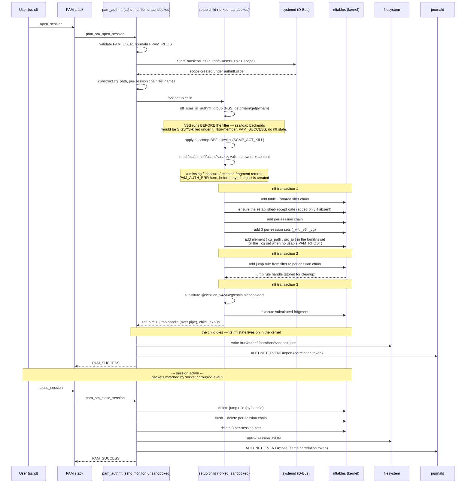
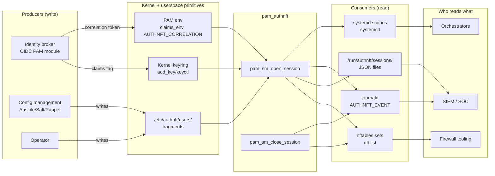

# pam_authnft concepts

What pam_authnft is for and how it works: use cases, the cgroupv2
packet-match mechanism, and the six stable integration interfaces.
Installation and configuration live in [ADMIN_GUIDE.md](ADMIN_GUIDE.md);
the full lifecycle, trust model, and seccomp design in
[ARCHITECTURE.txt](ARCHITECTURE.txt).

## Use cases

pam_authnft works with any PAM-enabled service. The scenarios where it
matters most:

- **SSH servers** — per-session firewall policy without wrapper scripts or
  ForceCommand hacks. A user's fragment can restrict outbound ports,
  pin allowed destinations, or enable masquerade only for that session.
  Filtering applies to sockets the user opens inside their session
  (listeners, outbound connections); the SSH control connection itself
  is handled by the shared established-accept the module
  adds to the shared filter chain ahead of session jumps. See
  [ARCHITECTURE.txt](ARCHITECTURE.txt) for the full trust model.
- **VPN concentrators** (WireGuard, OpenConnect, strongSwan) — per-tunnel
  packet filtering tied to the VPN's PAM authentication, not a static
  ruleset that applies to all tunnels.
- **Bastion / jump hosts** — auditable per-session network access. Each
  session element is visible in `nft list table inet authnft`
  with username, PID, and optional claims tag, plus a shared correlation
  token in the systemd journal for SIEM join.
- **RADIUS / TACACS+ and OIDC deployments** — the `claims_env` mechanism
  can carry AAA attributes or token-derived claims from an upstream PAM
  module into the nftables element comment, creating a traceable link
  between the authentication decision and the firewall rule.
- **Bastion hosts fronting containers** — users authenticate via PAM (SSH,
  OIDC), pam_authnft restricts which container IPs and ports that session
  can reach. The match works inside containers on kernels with the
  namespace-aware cgroupv2 offset: mainline >= 6.11, and the LTS
  backports 6.6 >= 6.6.53 and 6.1 >= 6.1.112 (commit 7f3287db6543, plus
  the follow-up null-deref fix 7052622fccb1; both released September 2024).
  RHEL 9 / Rocky 9 / Alma 9 kernels (5.14-derived) do not have it. For
  policy enforcement *inside* Kubernetes pods (no PAM session), BPF cgroup
  programs are the natural path — see [TODO.txt](TODO.txt).

## How it works

The cgroupv2 filesystem assigns each cgroup directory a unique inode, stable
for the cgroup's lifetime. When systemd creates a transient `.scope` for
the session via D-Bus, all session processes land under that cgroup. The
module inserts `{ cgroup_path . src_ip }` into a named nftables set; the
kernel resolves the path to an inode at insert time via `socket cgroupv2
level 2`. At packet classification time, nftables reads the socket's
originating cgroup — the cgroup the socket was *created* in, not the cgroup
its owning task is currently in — and matches it against the set, binding
the firewall rule to the session without referencing PIDs, UIDs, or
usernames.

Session policy is inspectable with standard `nft` tooling
(`nft list table inet authnft`); no `bpftool` or BPF program inspection
required.

### Lifecycle at a glance



### Packet classification

When a packet enters the kernel, nftables walks the `filter` chain. The
first rule accepts established/related traffic (covering pre-scope
sockets like the SSH control connection itself). New connections jump
into a per-session chain; that chain's rules check the session's own
per-session set. Each session has its own chain and its own set — alice
and bob are matched by entirely different rules.

```text
   incoming packet
        │
        ▼
   ┌──────────────────────────────────┐
   │ chain filter                     │
   │ hook input, priority filter - 1  │
   ├──────────────────────────────────┤
   │ ct state established,related     │ ──▶ pre-scope sockets, accept
   │ jump session_alice_1127936       │ ──▶ alice's per-session chain
   │ jump session_bob_4321            │ ──▶ bob's per-session chain
   └─────────────────┬────────────────┘
                     │
                     ▼   (alice's session chain)
   ┌──────────────────────────────────┐         ┌──────────────────────────────────┐
   │ chain session_alice_1127936      │         │ set session_alice_1127936_v4     │
   ├──────────────────────────────────┤         ├──────────────────────────────────┤
   │ socket cgroupv2 level 2          │ lookup  │ { "authnft.slice/                │
   │   . ip saddr                     │ ──────▶│     authnft-alice-1127936        │
   │   @session_alice_1127936_v4      │         │     .scope" . 192.0.2.1 }        │
   │   accept                         │         └──────────────────────────────────┘
   │ (loaded from alice's fragment    │
   │  with @session_v4 placeholder    │
   │  substituted at open_session)    │
   └──────────────────────────────────┘

   key the set is matched on:
     socket's originating cgroup (set at socket creation)
     . packet source IP
```

Sessions are isolated from each other: alice's per-session chain only
ever references alice's per-session set, which contains exactly one
element (her cg_path . src_ip). Deleting her per-session set at
close_session — which takes the element with it — or deleting her
per-session chain, instantly stops her rules from firing; bob's chain and
set are untouched.

That stops admission, and it also stops the traffic her session already
admitted. Each session is issued an id, which its chain writes into the
conntrack mark of every connection it admits, and the shared chain
accepts established traffic only while that id is in the live-sessions
set. close_session removes the id, so the next packet of a long transfer
or a reverse tunnel opened during her session finds no accepting rule and
falls through to the site's deny.

The bound is therefore "no access after logout", not merely "no new
access". It used to be the latter: a connection established during a
session kept running to its natural end, because the shared
established-accept fired before any session rule and conntrack never
heard about the teardown (issue #103).

Flows the module never admitted are untagged and unaffected, which is
what carries the SSH connection the login arrived on. Ids are never
reused, since a recycled id would resurrect the flows its previous holder
revoked. Cases D1 to D3 and I1 to I6 of `make test-packet-flow` pin the
behaviour, and integration case 10.27 exercises the id lifecycle through
the module.

The module only ever adds `accept` rules, so it grants; it never denies.
Whatever denies is the site's, and it has to sit somewhere the module's
accepts can win. Two arrangements, one that works and one that does not,
both measured in `make test-packet-flow`.

A deny inside the module's own `filter` chain works, wherever in that
chain it sits. Each session's jump goes immediately after the shared
established-accept gate rather than at the end, so every
jump precedes the deny no matter how many sessions open after it was placed
[E6, E8], while established traffic still short-circuits at the ct rule
without entering any session chain [E9]. Appending was the earlier behaviour
and it meant a session opened after the deny was never reached at all,
while an earlier session on the same host kept working [E4, E5].

A deny in a separate base chain does not work, at any priority [E3]. In
netfilter, `accept` ends the chain it fires in, not the hook: the packet
goes on to the next base chain, and a drop policy there kills it. The
module's counter records the accept and the connection dies anyway. A
module that only accepts cannot override a later chain's drop, so this is
not something rule ordering can fix. See the deployment contract in
[ADMIN_GUIDE.md](ADMIN_GUIDE.md) for what to do instead.

On session open:

1. Normalises `PAM_RHOST`: IPv4/IPv6 literals pass through, zone suffixes
   stripped, hostnames handled per `rhost_policy` (see [Module
   arguments](ADMIN_GUIDE.md#module-arguments)).
2. Creates a named transient `.scope` under `authnft.slice` via D-Bus.
3. Constructs the scope's cgroupv2 path (`authnft.slice/<scope>.scope`) and
   stores it in PAM data alongside per-session chain/set names, the
   normalised source IP, and a correlation token.
4. Forks a short-lived setup child. In that child, and **before** any
   sandbox is applied, resolves `authnft` group membership through NSS
   (`getgrnam`/`getpwnam`). A non-member returns `PAM_SUCCESS` and no
   nftables state is created. NSS runs unsandboxed on purpose: backends
   like `sss` and `ldap` issue syscalls the allowlist does not cover and
   would be SIGSYS-killed under it.
5. Locks **that child** — and only that child — with a seccomp-BPF
   allowlist (`SCMP_ACT_KILL` default). The calling PAM process (the sshd
   privsep monitor) is never filtered; the D-Bus call above already ran
   outside the sandbox.
6. Validates the user's root-owned fragment at
   `/etc/authnft/users/<username>` (must exist, be uid 0, and not be
   world-writable) and content-checks it. A missing, insecure or rejected
   fragment fails the session here, before any nftables object exists.
7. Creates a per-session chain (`session_<user>_<pid>`) and three
   per-session sets (`_v4`, `_v6`, `_cg`), and inserts a session element
   into the set for the resolved IP family — or into `_cg` (keyed on the
   cgroup path alone) when no usable `PAM_RHOST` was available. Adds a
   jump rule in the shared `filter` chain.
8. Loads the fragment, substituting four placeholders (`@session_v4`,
   `@session_v6`, `@session_cg`, `@session_chain`) with the live
   per-session names, and executes the result as nftables commands.
9. The child reports its result over a pipe and exits. Its nftables state
   lives on in the kernel. Back in the unsandboxed parent:
   `/run/authnft/sessions/<scope_unit>.json` is written **0640 root:root**
   — root-only, because it carries `claims_tag` — so a privileged observer
   can correlate the cgroup back to the owning session. See
   [INTEGRATIONS.txt](INTEGRATIONS.txt) §5.6.
10. Emits a structured `AUTHNFT_EVENT=open` journal entry with the
    correlation token — see [INTEGRATIONS.txt](INTEGRATIONS.txt)
    §6.2.

On logout the stored session state is retrieved from PAM data: the jump rule
is deleted by handle, the per-session chain is flushed and deleted, and the
three per-session sets are deleted — all in one transaction. If that
transaction aborts because an object is already gone (its element's 24h
timeout fired, an orphan reap ran, an operator cleaned up by hand), each
object is torn down in its own transaction instead, so one missing object
cannot strand the rest. Teardown is best-effort: `close_session` always
unwinds. The session-identity JSON is unlinked and a matching
`AUTHNFT_EVENT=close` journal entry is emitted with the same correlation
token. The shared `filter` chain and `authnft` table persist across
sessions.

For the full lifecycle, trust model, and seccomp details, see
[ARCHITECTURE.txt](ARCHITECTURE.txt).

## Integration surface

pam_authnft is deliberately small and composable. It exposes six stable
interfaces; the [integration contracts](INTEGRATIONS.txt) document
each one with MUST/SHOULD requirements and versioning guarantees.

| Interface | What it is | Who cares |
|---|---|---|
| **PAM** | Exactly two exported symbols: `pam_sm_open_session`, `pam_sm_close_session`. Reads `PAM_USER`, `PAM_RHOST`, and optionally two env vars (`claims_env=NAME`, `AUTHNFT_CORRELATION`). | PAM module authors, distro packagers |
| **nftables sets** | Three per-session sets per active session (`session_<user>_<pid>_{v4,v6,cg}`) under `table inet authnft`, inspectable via `nft list`. | Firewall tooling, policy engines |
| **Per-user fragments** | Plain nftables syntax at `/etc/authnft/users/<user>`. May use `include` to compose shared group-level rules (§4.6). | Config management (Ansible/Salt/Puppet), identity brokers |
| **systemd** | Transient `.scope` units under `authnft.slice`. Discoverable via `systemctl list-units 'authnft-*.scope'`. All `systemd.resource-control(5)` directives available. | Orchestrators, resource-accounting tools |
| **claims_env** | Optional keyring-payload channel: an upstream PAM module writes a tag via `add_key(2)` + `pam_putenv(3)`; pam_authnft reads, sanitizes, and embeds it in the nftables element comment. | AAA/audit integrations, identity brokers |
| **Session JSON + journal events** | `/run/authnft/sessions/<scope_unit>.json` for observability (§5.6); `AUTHNFT_EVENT=open/close` journald records with a shared `AUTHNFT_CORRELATION` token (§6.2). | SIEM collectors, workload schedulers, operator dashboards |

The module is not a plugin host. There is no shared-library ABI, no
callback registry. Every contract uses an existing kernel or userspace
primitive (PAM env, kernel keyring, filesystem, D-Bus, netlink, journald)
with a narrow schema.



Producers (left) are independent of consumers (right). pam_authnft sits
in the middle with no shared library or callback registry — every arrow
is a documented kernel or userspace primitive.
